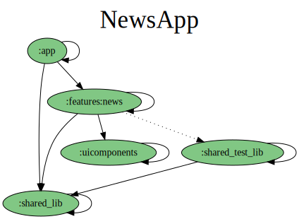

# Android boilerplate sample  app

The purpose of this repository is to provide a starting point for an app,
containing most common configurations a project would need.

### Project module structure

### Additionally there are:
[ktlint] - for code quality check
[integration tests] - for simple navigation testing
[unit test] - for behaviour test, not enough though :(
[github workflows] - to run the pipeline on each commit to main (kept it simple)
[test coverage report] - each pipeline run displays the test coverage

### Paparazzi snapshot testing

1. https://cashapp.github.io/paparazzi/
   Needs git lfs for initial setup of the repo.

### Todos:
1. Pipeline publish app to some store.
2. Pipeline rename github repository.

3. Custom material theme object, sizes object, font styles object.

4. Translations (localisations).

5. Multiple news sources filter selection.
6. Multiple languages in filter selection.

7. Update readme.
